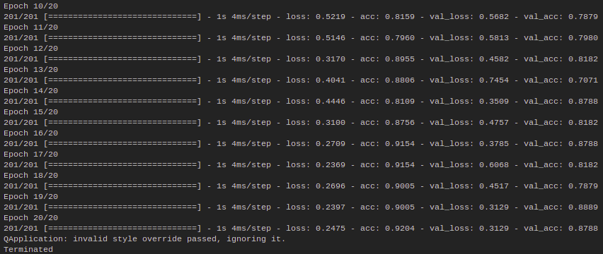
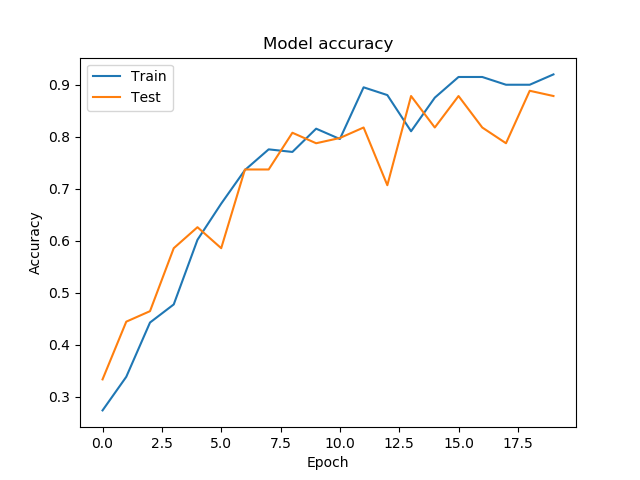
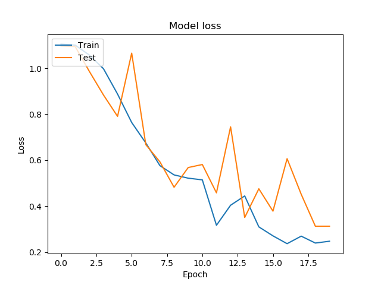
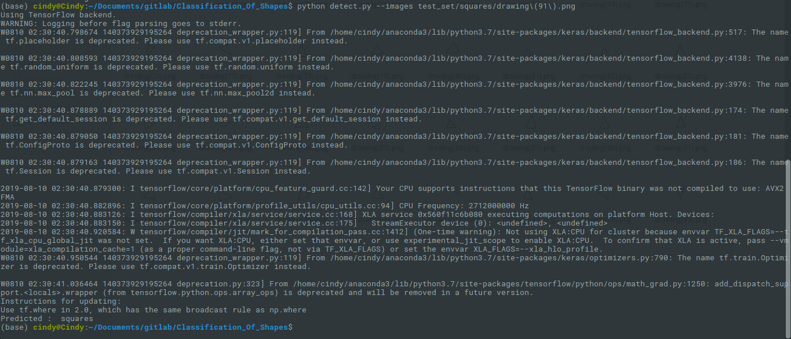
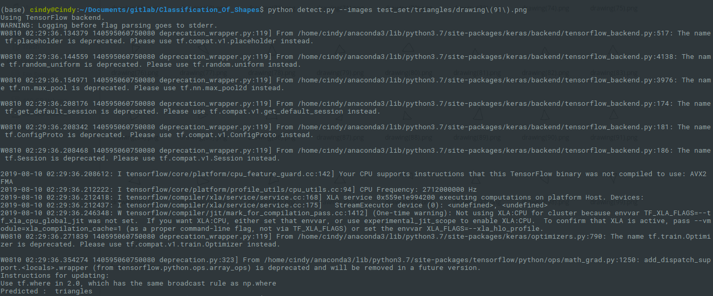

# Classification Of Shapes

**Datatrain available in test_set and training_set folder. I do predict with CNN algorithm.**

### Tools that needed to be installed are :
- Keras version 2.2.4
- matplotlib version 2.2.0

### Introduction
In this project, I make some classification to classify shapes there are circles, squares, or triangles. I use Keras library and some other library. In this project I also make some prediction after I train my program on file 'train.py', and the result to predict new image on file 'detect.py'. 

### How to run 
#### Training

```
$ python train.py
```

#### Detection
You just only need to type this on your terminal :  

```
$ python detect.py --images directory/image.png
```

### Installation 
There are something you have to do before running the program. You have to install all library we needed, if you haven't install before.

- First step, you have to install keras on your pc   
    you can watch keras installation on https://keras.io/#installation

- Second step, you have to install matplotlib on your pc   
```
$ pip install matplotlib
``` 

### Dataset
In this project, I use shapes for dataset which is circle, square, and triangle. I've got this data from https://www.kaggle.com/cactus3/basicshapes. There are 300 image containing 100 pictures each of circle, rectangle, and triangle. I split data for training set 67% and for test set 33%. 

### Result of training
After I train my program, I got the accuracy is 92.04% using 20 epoch.



And also I plot my training result :



If we look closer to my image, we can see that the accuracy from my train is almost overfitting. and that's why I make 20 epochs.  
And the result for loss is :



### Resutl of predict
I predict my model, and the result for trying to predict square image is this:



My program already classify square into square class. And then, when I try to predict triangle image is this:



And I can say that my model to classify shapes is work. 

### My Model Result
I save my model on 'my_model.h5'.

